<!--
  ✏️ CUSTOMIZE BEFORE PUSHING
  1. Swap "your-portfolio-url.com", "your-linkedin", "your-handle", "you@example.com" for the real ones.
  2. Replace every "#" placeholder link in "Featured Builds" with the actual repo URL (or delete the line if a project isn't public).
  3. This file must live in a repo named EXACTLY "prateekgaurdev" (same as your username) — that's what makes GitHub render it as your profile page.
  4. Optional: wire up the Contribution Snake action in the collapsed section near the bottom.
-->

<div align="center">

</div>

<div align="center">

```
        ┌───────────────┐
        │   ◉       ◉  │
        │       ▽       │
        └───────────────┘
           SYSTEM: ONLINE
```

</div>

<div align="center">

[](https://github.com/prateekgaurdev)

</div>

<p align="center"><i>Welcome to my corner of the machine — where late-night debugging turns into shipped systems.</i></p>

<div align="center">

[](https://prateekgaur.in)
[](https://linkedin.com/in/gaur-prateek)
[](https://x.com/your-handle)
[](mailto:gaur.prateek@gmail.com)

</div>

<div align="center">


</div>

<div align="center"></div>

## 🤖 whoami

```bash
$ whoami --verbose

> user:            prateekgaurdev
> role:            AI Engineer / Full-Stack Systems Builder
> core_focus:      [LLM fine-tuning, browser automation, production ML systems]
> active_process:  fine-tuning Gemma-class models (LoRA / QLoRA) → deploying to AWS
> approach:        theory-first, then ship
> known_side_fx:   probably mid-way through another technical take-home assessment
> uptime:          counting commits since first "git init"

$ echo $STATUS
SHIPPING
```

<div align="center"></div>

## 🧠 Neural Stack

<div align="center">

**Languages**


**AI / ML**


**Backend**


**Frontend**


**Automation & Infra**


</div>

<div align="center"></div>

## 📊 System Diagnostics

<!--
  The stats + top-languages cards below are commented out on purpose.
  The shared public instance (github-readme-stats.vercel.app) is currently
  returning 503 DEPLOYMENT_PAUSED for everyone, not just you — see
  https://github.com/anuraghazra/github-readme-stats/issues/4737
  Fix: fork https://github.com/anuraghazra/github-readme-stats, deploy your
  own copy to Vercel (free, ~5 min, one env var = a GitHub token), then swap
  "github-readme-stats.vercel.app" below for your own *.vercel.app domain
  and uncomment this block.

<table align="center">
<tr>
<td></td>
<td></td>
</tr>
</table>
-->

<div align="center">

</div>

<div align="center"></div>

## 🏆 Achievements

<!--
  Same story as above — the shared public instance of github-profile-trophy
  is rate-limited/paused for everyone right now (a known, recurring issue:
  https://github.com/ryo-ma/github-profile-trophy/issues). Fix: fork
  https://github.com/ryo-ma/github-profile-trophy, deploy your own copy to
  Vercel, swap the domain below, then uncomment.

<div align="center">

</div>
-->


<div align="center"></div>

## ⚡ Featured Builds

#### 🧩 repoview (`rv`)
Python CLI tool that converts entire codebases into LLM-ready context files — smart diffing, watch mode, focus mode, and direct GitHub URL support. Ships with its own React + Tailwind marketing site.

`Python` `CLI` `LLM Tooling`
🔗 [Repo →](https://repoview.prateekgaur.in/)

---

#### 🏠 RoomBuilder — AI Interior Design Studio
AI-assisted interior design and architectural planning app. One track uses Roboflow + Gemini Vision to segment floor plans, rendered in a React Three Fiber / Zustand 3D viewer; a second track is a 2D planner built on Next.js and React Konva with miter-jointed wall extrusion.

`Next.js` `React Three Fiber` `Gemini Vision` `Roboflow`
🔗 [Repo →](#)

---

#### 🧱 Floor Plan Wall Segmentation Engine
Hybrid vision + math pipeline for extracting walls from architectural CAD drawings — a Gemini-based detection stage feeding a DXF geometry module for precise mathematical wall extraction.

`Gemini Vision` `DXF` `Computer Vision`
🔗 [Repo →](#)

---

#### 🔔 Unified Notification Orchestration Platform
Microservices notification gateway unifying voice, WhatsApp, and push/in-app channels — Python/FastAPI and Node.js/TypeScript services behind a shared API gateway, a common Supabase schema, and a React control panel.

`FastAPI` `Node.js` `Supabase` `Microservices`
🔗 [Repo →](#)

---

#### 💳 Multi-Rail Payout Orchestration API
Payment orchestration layer unifying three payout rails — Plaid (US ACH), XE (international transfers), and Giftogram (digital gift cards) — behind a single Supabase edge-function gateway.

`Supabase Edge Functions` `Plaid` `Fintech`
🔗 [Repo →](#)

---

#### 🕶️ Vision-Guided Browser Automation
Computer-vision-driven browser automation pipeline (evolved from a YOLO+vision hybrid to a leaner Gemini-only vision stack) for robust, human-like web interaction at scale.

`Playwright` `Selenium` `Computer Vision`
🔗 [Repo →](#)

<div align="center"></div>

<details>
<summary>🐍 Bonus: Live Contribution Snake (GitHub Action setup)</summary>

<br/>

Add `.github/workflows/snake.yml`:

```yaml
name: generate animated snake

on:
  schedule:
    - cron: "0 */6 * * *"
  workflow_dispatch: {}
  push:
    branches:
      - main

jobs:
  generate:
    permissions:
      contents: write
    runs-on: ubuntu-latest
    steps:
      - name: generate github-contribution-grid-snake.svg
        uses: Platane/snk@v3
        with:
          github_user_name: ${{ github.repository_owner }}
          outputs: |
            dist/github-contribution-grid-snake.svg
            dist/github-contribution-grid-snake-dark.svg?palette=github-dark

      - name: push snake to output branch
        uses: crazy-max/ghaction-github-pages@v4
        with:
          target_branch: output
          build_dir: dist
        env:
          GITHUB_TOKEN: ${{ secrets.GITHUB_TOKEN }}
```

Then embed it back in this README:

```markdown
<picture>
  <source media="(prefers-color-scheme: dark)" srcset="https://raw.githubusercontent.com/prateekgaurdev/prateekgaurdev/output/github-contribution-grid-snake-dark.svg">
  <source media="(prefers-color-scheme: light)" srcset="https://raw.githubusercontent.com/prateekgaurdev/prateekgaurdev/output/github-contribution-grid-snake.svg">
  
</picture>
```

</details>

<div align="center">

</div>

<div align="center"><sub>⚡ built and maintained by prateekgaurdev — powered by caffeine, curiosity, and a few too many take-home assessments.</sub></div>
